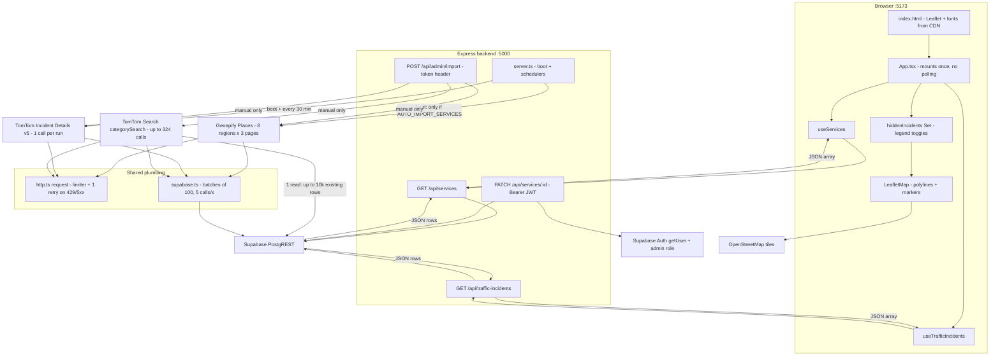
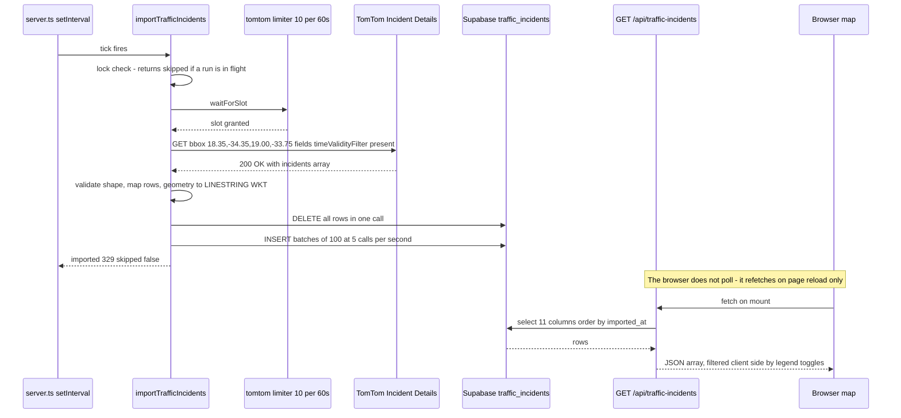
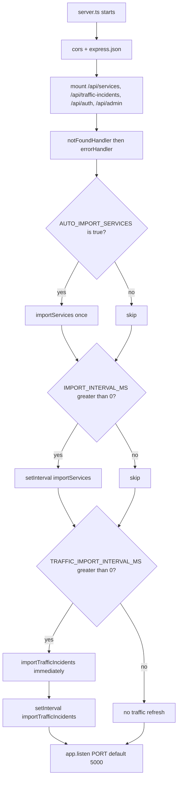

# API Integration Guide

Where every external API is called from, how it is called, and when it fires.

This document describes the API surface of the Service Finder ("The Cape Guide") app as it exists in
the codebase. Every statement below is traceable to a file and line reference, so if you change one of
these files, update the matching section here.

| | |
|---|---|
| Scope | Backend integrations (Geoapify, TomTom, Supabase) + browser-side APIs (OSM tiles, Google Maps link, CDN assets) |
| Backend base URL | `http://localhost:5000` (`PORT` in `backend/.env`) |
| Frontend base URL | `http://localhost:5173` (Vite dev server) |
| Frontend API base | `frontend/src/services/api.ts:6` — `VITE_API_URL`, falling back to `http://localhost:5000/api` |

---

## Contents

1. [API inventory](#1-api-inventory)
2. [When each API fires](#2-when-each-api-fires)
3. [How each integration works](#3-how-each-integration-works)
4. [Diagrams](#4-diagrams)
5. [What a session looks like in time](#5-what-a-session-looks-like-in-time)
6. [Observing the integrations](#6-observing-the-integrations)
7. [Quota budget](#7-quota-budget)
8. [Known issues and gotchas](#8-known-issues-and-gotchas)

---

## 1. API inventory

| # | API | Called from | Auth | Purpose |
|---|---|---|---|---|
| 1 | **Geoapify Places** — `api.geoapify.com/v2/places` | `backend/src/api/geoapify/client.ts:23` | `apiKey` query param | Bulk-import public services into `services` |
| 2 | **TomTom Incident Details v5** — `/traffic/services/5/incidentDetails` | `backend/src/api/tomtom/client.ts:18` | `key` query param | Traffic jam / closure / road-works snapshot |
| 3 | **TomTom Search (`categorySearch`)** — `/search/2` | `backend/src/api/tomtom/client.ts:141-156` | `key` query param | POI search to insert / enrich services |
| 4 | **Supabase PostgREST — reads** | `backend/src/controllers/serviceController.ts:14-22`, `controllers/accidentController.ts:7-10`, `models/Service.ts`, `models/accident.ts` | service-role key (`config/supabase.ts`) | Serve cached rows to the browser |
| 5 | **Supabase PostgREST — writes** | `backend/src/api/lib/supabase.ts:24,44,56` | service-role key | Upsert, and delete-then-insert |
| 6 | **Supabase Auth** — `auth.getUser()` | `backend/src/middleware/auth.ts` | `Authorization: Bearer <jwt>` | Guard `PATCH /api/services/:id` |
| 7 | **OpenStreetMap raster tiles** | browser — `frontend/src/App.tsx:194` via Leaflet | none (public) | Map base layer |
| 8 | **Google Maps directions** | browser — `frontend/src/App.tsx:409`, `window.open` deep link (no SDK) | none | "Get Directions" button |
| 9 | **unpkg CDN + Google Fonts** | `frontend/index.html:7,9,14` | none | Leaflet 1.9.4 CSS/JS + web fonts |

**Key rule:** the browser never calls Geoapify, TomTom or Postgres directly. It only calls our own Express
API. Provider API keys live exclusively in `backend/.env` and are never bundled into the frontend.

`frontend/src/services/api.ts` contains the only three `fetch()` calls in the frontend:

| Function | Request | Used by |
|---|---|---|
| `getServices()` | `GET {API_URL}/services?limit=500` | `hooks/useServices.ts` → `App.tsx` |
| `getServiceDetails(externalId)` | `GET {API_URL}/services/{externalId}` | **nothing — currently unused** |
| `getTrafficIncidents()` | `GET {API_URL}/traffic-incidents` | `hooks/useTrafficIncidents.ts` → `App.tsx` |

---

## 2. When each API fires

| API | Trigger | Frequency |
|---|---|---|
| Geoapify Places | `AUTO_IMPORT_SERVICES=true` at boot, `IMPORT_INTERVAL_MS>0`, or `POST /api/admin/import/services` | **Never automatically** while both env vars are unset — manual only |
| TomTom Incidents | `TRAFFIC_IMPORT_INTERVAL_MS>0` → one immediate import at boot plus a `setInterval`; or `POST /api/admin/import/accidents` | **Every 30 min** + once at boot + any manual call |
| TomTom Search | `POST /api/admin/import/tomtom/services` | **Manual only** — deliberately never scheduled |
| Supabase reads | Browser page load (two hooks on mount); every `PATCH /api/services/:id` | On demand |
| Supabase writes | Inside whichever importer is running | Once per import run |
| Supabase Auth | Every `PATCH /api/services/:id` | On demand |
| OSM tiles | Leaflet pans / zooms | Continuous while panning |
| Google Maps | "Get Directions" click | On click |
| CDN + fonts | Page load | Once per page load |

Current values in `backend/.env`:

```
GEOAPIFY_MAX_PAGES=3
TOMTOM_URL=https://api.tomtom.com/traffic/services/5/incidentDetails
TOMTOM_SERVICE_RADIUS=50000
AUTO_IMPORT_TRAFFIC=true
TRAFFIC_IMPORT_INTERVAL_MS=1800000     # 30 minutes
# IMPORT_INTERVAL_MS and AUTO_IMPORT_SERVICES are unset -> Geoapify import is off
```

> **Note:** the frontend does **not** poll. Both hooks fetch once on mount with empty dependency arrays
> (`hooks/useServices.ts:10-25`, `hooks/useTrafficIncidents.ts:10-25`), so an open tab keeps showing its
> original snapshot even while the backend keeps refreshing. Reload to see newer data.

---

## 3. How each integration works

### 3.1 Geoapify Places — services bulk loader

`importServices()` in `backend/src/api/geoapify/client.ts:34-112`:

1. Takes a **single-flight lock** (`importInProgress`). A concurrent call returns `{ imported: 0, skipped: true }`.
2. Calls `ensureServiceCategories()` (see `services/categoryService.ts`) so the category tree exists.
3. Loops the **8 rectangular tiles covering South Africa** defined in `southAfricaRegions`, and for each tile
   requests up to `GEOAPIFY_MAX_PAGES` pages of 300 features, stopping early when a page returns fewer than 300.

   Worst case: **8 tiles × 3 pages = 24 Geoapify calls per run**, each gated by the `geoapify` limiter
   (**10 calls / 60 s**, set at `client.ts:5`) → a full run takes ~2 minutes of throttled calls.
4. Maps each feature to a row: `external_id = properties.place_id`, `location = 'SRID=4326;POINT(lon lat)'`,
   `type`/`category_id` resolved through `resolveCategorySlug()`.
5. Writes with **`upsertToSupabase('services', rows, { batchSize: 100, onConflict: 'external_id' })`** —
   re-running the import is idempotent.

Request shape:

```ts
geopaify(key).get(path, {
  categories,                                   // 11 Geoapify category slugs joined with commas
  filter: `rect:${west},${south},${east},${north}`,
  limit: 300,
  offset: page * 300,
})
```

Triggered by `POST /api/admin/import/services`, or automatically only if `AUTO_IMPORT_SERVICES=true`
and/or `IMPORT_INTERVAL_MS>0` (see `server.ts:24-33`).

### 3.2 TomTom Incident Details v5 — traffic layer

`importTrafficIncidents()` in `backend/src/api/tomtom/client.ts:27-70`:

1. Single-flight lock (`trafficImportInProgress`).
2. **Exactly one** TomTom request per run, through the `tomtom` limiter (10 calls / 60 s, `client.ts:7`):

   ```ts
   tomtom(key).get(path, {
     bbox: tomtomBbox,                 // default '18.35,-34.35,19.00,-33.75' (Cape Town)
     fields: incidentFields,           // iconCategory, magnitudeOfDelay, events, from/to, length, delay, roadNumbers
     language: 'en-GB',
     timeValidityFilter: 'present',    // only currently-active incidents
   })
   ```
3. Validates the response shape (`isTrafficIncidentsResponse` → `isTrafficIncidentFeature`): every feature must be
   `type: 'Feature'` with a `LineString` geometry of numeric `[lon, lat]` pairs. A malformed payload throws instead
   of writing garbage.
4. Maps each feature to a row: geometry → `LINESTRING(...)` WKT prefixed with `SRID=4326;`,
   `properties.length → length_m`, `properties.delay → delay_seconds`,
   `properties.events[0].description → description`.
5. Writes with **`replaceInSupabase('traffic_incidents', rows, { batchSize: 100 })`** — a full `DELETE` followed by
   inserts, because incidents are a transient snapshot rather than durable records. 329 incidents = 1 delete + 4 inserts.

**Scheduling** (`backend/src/server.ts:37-46`): when `TRAFFIC_IMPORT_INTERVAL_MS > 0`, the server fires one import
immediately at boot (so the map is not empty for the first cycle) and then repeats on the interval. The importer's
own lock makes a concurrent run a no-op, so an overlapping tick cannot double-spend quota.

> Caveat: because the write is delete-then-insert, a failed run **after** the delete leaves the table empty. The
> interval self-heals on the next successful tick; if the monthly quota is exhausted it stays empty until reset.

### 3.3 TomTom Search (`categorySearch`) — service enrichment

`importTomTomServices()` in `backend/src/api/tomtom/client.ts:227-281`:

1. Single-flight lock (`serviceImportInProgress`).
2. **12 categories × 9 centres** (`TOMTOM_SERVICE_CATEGORIES`, `TOMTOM_SERVICE_CENTERS`, radius
   `TOMTOM_SERVICE_RADIUS=50000`, `countrySet=ZA`) × up to `TOMTOM_SERVICE_MAX_PAGES=3` pages of 100
   → **up to 324 Search requests in a single run**, at 10/min ≈ 33 minutes of throttling.
3. Deduplicates results by TomTom `id`.
4. Loads up to 10,000 existing services in one Supabase read.
5. For each result: **insert** if there is no match, otherwise **enrich** only the fields that are currently blank
   (`enrichableFields`). Matching is by `external_id` **or** normalised name plus a distance check of ≤ 150 m
   (`normalizeName`, `parsePoint`, `distanceInMeters`). This is how Geoapify and TomTom rows can coexist.
6. Inserts go through `upsertToSupabase(..., { onConflict: 'external_id' })`.

Triggered only by `POST /api/admin/import/tomtom/services`. **This is the largest quota consumer in the project and
is intentionally never scheduled.**

### 3.4 Supabase reads — how the browser gets data

| Route | Handler | Query |
|---|---|---|
| `GET /api/services` | `controllers/serviceController.ts:5-29` | `select('*, category:service_categories(id,name,slug,parent_id)')`, `limit` clamped to 1–500 (default 100), optional `?type=` (`category.slug`) and `?q=` (`ilike name`) |
| `GET /api/services/:externalId` | `models/Service.ts` | single-row lookup |
| `GET /api/traffic-incidents` | `controllers/accidentController.ts:5-18` | 11 explicit columns from `traffic_incidents`, ordered by `imported_at desc`; returns a **bare array** |
| `GET /api/traffic-incidents/:externalId` | `controllers/accidentController.ts:21-34` | **bug:** `fetchAccidentDetails()` reads the `services` table, not `traffic_incidents` |
| `PATCH /api/services/:id` | `controllers/serviceController.ts:48+` | find-then-update, admin only |

### 3.5 Supabase writes — throttled and batched

`backend/src/api/lib/supabase.ts`:

- `setRateLimit('supabase', 5, 1_000)` — 5 PostgREST calls per second, enforced by the same limiter class used for
  the external APIs.
- `upsertToSupabase(table, rows, { batchSize = 100, onConflict })` — `await waitForRateLimit()` **before every
  batch**, then `upsert(...).select()`.
- `replaceInSupabase(table, rows, { batchSize = 100 })` — throttled `DELETE` (using the
  `.neq('id', '00000000-0000-0000-0000-000000000000')` "delete-all" trick, because Supabase requires a filter),
  then batched inserts.

Importing 10,000 services therefore becomes 100 PostgREST calls spread over ~20 seconds rather than one burst.

### 3.6 Supabase Auth

`PATCH /api/services/:id` is guarded by `authenticateToken` then `requireAdmin` (`middleware/auth.ts`): the
`Authorization: Bearer <jwt>` token is validated with `supabase.auth.getUser()`, and the user's
`app_metadata.role` must equal `admin`. No frontend code calls this route yet.

Admin **imports** use a different, simpler scheme: `middleware/adminImportAuth.ts` compares the
`x-admin-import-token` header against `ADMIN_IMPORT_TOKEN` and returns `401` on a mismatch.

### 3.7 Browser-side APIs

- **OpenStreetMap tiles** — `App.tsx:194`, `https://{s}.tile.openstreetmap.org/{z}/{x}/{y}.png`, restyled with a CSS
  sepia filter. Leaflet itself is loaded from **unpkg in `index.html:14`** as the global `L` (not an npm dependency).
- **Google Maps** — the "Get Directions" button opens
  `https://www.google.com/maps/dir/?api=1&destination=lat,lng` in a new tab. No SDK, no key.
- **Google Fonts** — `index.html:9`.

### 3.8 The shared throttle that wraps all external calls

Every external request funnels through `request()` in `backend/src/api/lib/http.ts:19-78`:

1. **Rate limit first** — `waitForRateLimit(options.limiter)` uses a named sliding-window `RateLimiter`
   (`api/lib/rate_limit.ts`). Names in use: `geoapify` (10/60 s), `tomtom` (10/60 s), `supabase` (5/1 s).
2. **One retry on 429/5xx** — honours `Retry-After` when present, otherwise backs off `250ms × 2^n`. The limiter is
   applied to the retry too, since it recurses through the same function.
3. **Errors are key-safe and useful** — on failure it strips `apiKey`/`key` from the URL before including it in the
   thrown message, and prefers TomTom's `detailedError.message` when the body is JSON.

Adding a new external API means: create a client under `backend/src/api/<provider>/`, call `setRateLimit()` for it,
and route every call through `request()` with that limiter name. See the README's "API import flow" section.

---

## 4. Diagrams

### 4.1 Who calls what



### 4.2 One 30-minute traffic tick



### 4.3 Boot sequence



---

## 5. What a session looks like in time

| Moment | What fires | External API calls |
|---|---|---|
| Backend boot | `importTrafficIncidents()` immediately (because `TRAFFIC_IMPORT_INTERVAL_MS > 0`) | 1 TomTom |
| Browser page load | `useServices()` + `useTrafficIncidents()` | 2 calls to our API → 2 Supabase reads |
| Pan / zoom | Leaflet tile fetch | OSM (free, no key) |
| Every 30 min | traffic scheduler tick | 1 TomTom |
| Legend category toggle | client-side filtering only | 0 |
| "Get Directions" click | Google Maps deep link | 0 |
| `POST /api/admin/import/accidents` | manual refresh | 1 TomTom |
| `POST /api/admin/import/services` | manual Geoapify import | up to 24 Geoapify |
| `POST /api/admin/import/tomtom/services` | manual enrichment | up to 324 TomTom Search |

---

## 6. Observing the integrations

```powershell
# 1. What is scheduled, and on what cadence
Select-String -Path 'backend/.env' -Pattern 'INTERVAL|AUTO_IMPORT'

# 2. Did the traffic tick run? imported_at advances every 30 minutes
node -e "fetch('http://localhost:5000/api/traffic-incidents').then(r=>r.json()).then(d=>console.log(d.length, d[0].imported_at))"

# 3. Incident mix currently on the map
node -e "fetch('http://localhost:5000/api/traffic-incidents').then(r=>r.json()).then(d=>{const m={};d.forEach(i=>m[i.icon_category]=(m[i.icon_category]||0)+1);console.log(JSON.stringify(m))})"

# 4. Force a refresh by hand (costs 1 TomTom request)
Invoke-RestMethod 'http://localhost:5000/api/admin/import/accidents' -Method Post `
  -Headers @{ 'x-admin-import-token' = '<ADMIN_IMPORT_TOKEN from backend/.env>' }
```

Runtime traces appear on the backend console only:

| Prefix | Source | Meaning |
|---|---|---|
| `[import]` | `server.ts` scheduler `.catch()` handlers | a scheduled import failed |
| `[rate_limit]` | `api/lib/rate_limit.ts:22` | a limiter is making a call wait |
| `[http]` | `api/lib/http.ts:52` | 429/5xx received, backing off before the single retry |
| `IMPORT ERROR` / `ACCIDENT IMPORT ERROR` | `routes/adminRoutes.ts` | a manual import threw |

> `middleware/requestLogger.ts` is currently a **0-byte placeholder**, so there is no HTTP access log.

---

## 7. Quota budget

| API | Calls per action | At the current schedule | Notes |
|---|---|---|---|
| TomTom Incident Details | 1 | **~1,440 / month** (every 30 min) + 1 per manual trigger | ~58% of the 2,500/month free tier |
| Geoapify Places | up to 24 | **0** while unscheduled | only consumed by manual runs |
| TomTom Search | up to 324 | **0** while unscheduled | pressing it ~8× in a month exhausts a 2,500 quota |
| Supabase | 1 read / 1 per 100 rows written | depends on import volume | 5 calls/s self-imposed throttle |

Because the traffic scheduler deletes before it inserts, quota exhaustion is the one failure mode that cannot
self-heal: a failed run leaves `traffic_incidents` empty until the next successful tick, and if the monthly cap is
reached that means waiting for the quota to reset. The TomTom **Search** importer is the largest single consumer and
is deliberately manual-only.

---

## 8. Known issues and gotchas

Ordered by how likely they are to bite you.

1. **`frontend/.env` holds a copy of the backend secrets.** It contains `SUPABASE_SERVICE_KEY`,
   `ADMIN_IMPORT_TOKEN`, `GEOAPIFY_API_KEY` and `TOMTOM_API_KEY` — but no `VITE_API_URL`. Because none of those are
   `VITE_`-prefixed, Vite will not inline them into the bundle (the browser never sees them), and the file is
   git-ignored, so this is not an active leak. It does mean the frontend is silently running on the hardcoded
   fallback `http://localhost:5000/api` from `frontend/src/services/api.ts:6`, which will break any deployed build.
   Recommended: keep `frontend/.env` to just `VITE_API_URL=http://localhost:5000/api`, and leave provider keys in
   `backend/.env` only. `frontend/.env.example` currently documents `VITE_API_BASE_URL`, which the code does not read.
2. **The browser never re-fetches.** Both hooks run once on mount with empty dependency arrays, so a tab left open
   shows a stale snapshot even though the backend refreshes every 30 minutes. Adding a poll (e.g. every 5 minutes) to
   `useTrafficIncidents` costs **zero provider quota** — it only hits our own API.
3. **`GET /api/traffic-incidents/:externalId` reads the wrong table.** `models/accident.ts` queries `services`, so the
   route can never return an incident. Currently harmless because no client calls it.
4. **Traffic refreshes blank the table if they fail.** `replaceInSupabase` deletes first, then inserts; a failure in
   between leaves `traffic_incidents` empty until the next successful tick. A safer pattern is upsert-then-prune
   (upsert by id, then delete rows whose `imported_at` is older than the current run).
5. **Editing `backend/.env` does not restart the server.** nodemon watches `.ts`/`.js`/`.json`, not `.env`, so
   interval changes only take effect after a manual restart. This is why `server.ts` has to be touched to apply a new
   cadence during testing.
6. **The TomTom Search importer is the quota landmine** — up to 324 requests per press. Keep it manual, or convert it
   to a single bounding-box search per category before scheduling it.
7. **The TomTom traffic integration is on the legacy v5 endpoint.** TomTom recommends the Orbis
   `https://api.tomtom.com/maps/orbis/traffic/incidents/details` endpoint (`apiVersion=2`) for new integrations, which
   moves the key into a `TomTom-Api-Key` **header**, replaces `fields` with an `Attributes` **header**, renames
   `length`/`delay` to `lengthInMeters`/`delayInSeconds`, and returns **string** category values (`roadworks`,
   `road-closed`, `jam`, …) instead of numeric `iconCategory` codes. A shim that maps those strings back to the
   existing numeric codes inside `client.ts` would migrate the endpoint with no database or frontend change.
   See [TomTom's migration guide](https://developer.tomtom.com/traffic-api/documentation/migration-guide).
8. **Legacy README references are out of date.** The README points at `backend/src/services/mapsService.ts` as the one
   place all Maps API calls go through. That file exists, but it is only a stub: an in-memory cache skeleton plus a
   `geocode()` whose real API call is still a `TODO`, with **no callers anywhere** in the backend. It also points
   readers at `docs/roadblock-notes.md`, which does not exist. The rate-limit defence the README describes is actually
   implemented by `api/lib/http.ts` + `api/lib/rate_limit.ts` + `api/lib/supabase.ts` (see section 3.8). In the same
   way, the README's `frontend/src/components/Map` fallback component is an empty placeholder — the map, its markers
   and its error/loading states live inline in `frontend/src/App.tsx`.
9. **Placeholder files that are 0 bytes** (Phase 2 work still to come): all of `frontend/src/pages/*`,
   `frontend/src/components/*` (`Map`, `AdminPanel`, `Auth`, `common`, `Dashboard`, `SearchBar`, `ServiceCard`),
   `frontend/src/context/AuthContext.tsx`, `frontend/src/hooks/useAuth.ts`, `frontend/src/services/authService.ts`,
   `frontend/src/services/mapsService.ts`, `frontend/src/utils/*`, `frontend/src/styles/variables.css`, plus
   `backend/src/services/authService.ts`, `backend/src/utils/apiResponse.ts` and
   `backend/src/middleware/requestLogger.ts`. `backend/src/routes/authRoutes.ts` has no handlers mounted either, so
   `/api/auth` currently answers with the not-found handler.
